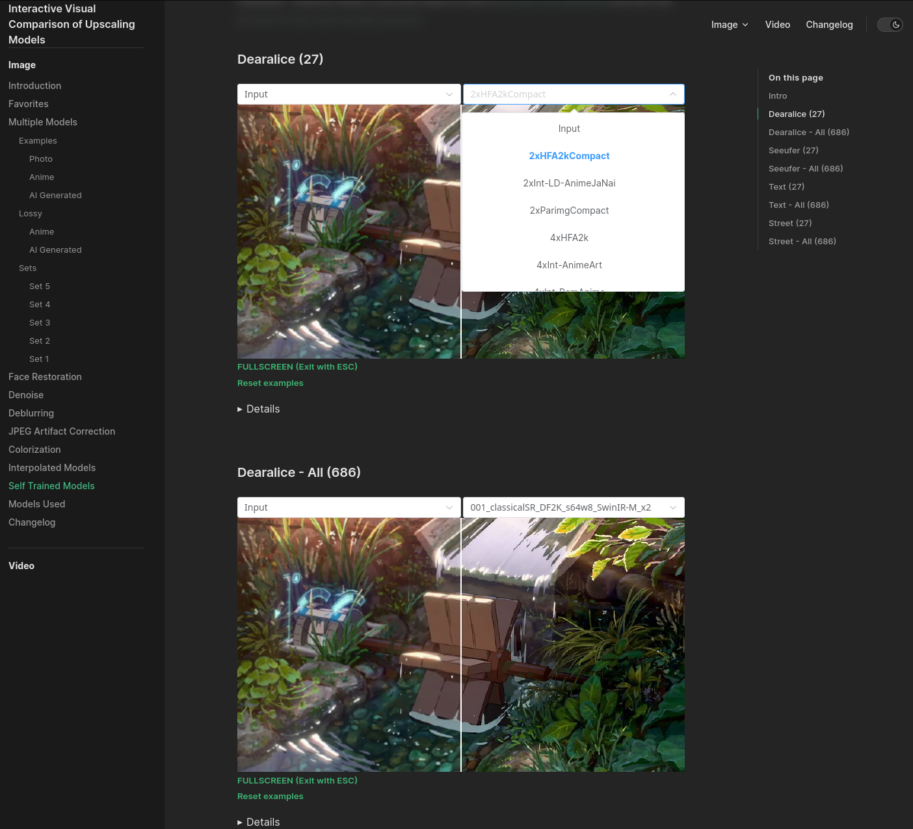
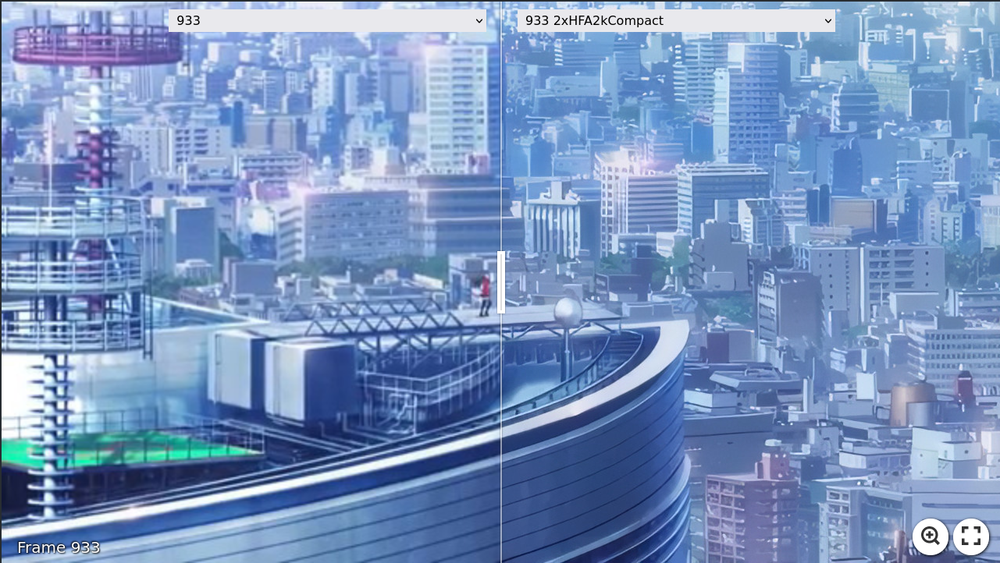

# Models

A repo for me to publish trained models. After having made my [interactive visual comparison site of upscaling models](https://phhofm.github.io/upscale/) I started training image models myself. Released models have been trained for a minimum of 24 hours. Each folder should contain its own *README.md* file with infos to the model, while configs and examples may be present also. Most of these models can be run as a demo in this corresponding [gradio space](https://huggingface.co/spaces/Phips/upscale_demo) but inference times will be long.

### Released (sorted by new)

18.06.23  
**2xHFA2kAVCOmniSR & 2xHFA2kAVCOmniSR_Sharp**  
My tenth release, a 2x anime upscaling model that handles AVC (h264) compression trained on the [OmniSR](https://github.com/Francis0625/Omni-SR) network (second released community model to use this network, which paper released less than two months ago, on the 24.04.23).  

18.06.23  
**2xHFA2kAVCEDSR_M**  
My ninth release, a fast 2x anime upscaling model that handles AVC (h264) compression trained on the [EDSR](https://github.com/LimBee/NTIRE2017) network (M model).  

18.06.23  
**2xHFA2kAVCCompact**  
Also in my ninth release, a compact 2x anime upscaling model that handles AVC (h264) compression trained on the [SRVGGNet, also called Real-ESRGAN Compact](https://github.com/xinntao/Real-ESRGAN) network.  

14.06.23  
**4xHFA2kLUDVAEGRL_small**  
My eight release - 4x anime upscaling model handling real degradation, trained on the [GRL](https://github.com/ofsoundof/GRL-Image-Restoration) network (small model) with musl's HFA2kLUDVAE dataset.  

10.06.23  
**4xHFA2kLUDAVESwinIR_light**  
My seventh release - 4x anime upscaling model handling real degradation, trained on the [SwinIR](https://github.com/JingyunLiang/SwinIR) network (small model) with musl's HFA2kLUDVAE dataset.   

10.06.23  
**4xHFA2kLUDVAESRFormer_light**  
Also in my seventh release - 4x anime upscaling model handling real degradation, trained on the [SRFormer](https://github.com/HVision-NKU/SRFormer) network (light model) with musl's HFA2kLUDVAE dataset.  

01.06.23  
**2xLexicaRRDBNet & 2xLexicaRRDBNet_Sharp**  
My sixth release - a 2x upscaler for AI generated images (no degradations), trained on the [ESRGAN (RRDBNet)](https://github.com/xinntao/ESRGAN) network with around 34k images from lexica.art.  

10.05.23  
**4xNomos8kSC**  
My fifth release - a 4x realistic photo upscaling model handling JPG compression, trained on the [ESRGAN (RRDBNet)](https://github.com/xinntao/ESRGAN) network with musl's Nomos8k_sfw dataset together with OTF (on the fly degradation) jpg compression and blur.   

07.05.23  
**4xHFA2k**  
My fourth release - a 4x anime image upscaling model, trained on the [ESRGAN (RRDBNet)](https://github.com/xinntao/ESRGAN) network with musl's HFA2k dataset together with OTF (on the fly degradation) jpg compression and blur.    

05.05.23  
**2xParimgCompact**  
My third release - a 2x compact photo upscaling model trained on the [SRVGGNet, also called Real-ESRGAN Compact](https://github.com/xinntao/Real-ESRGAN) network with Microsofts ImagePairs (11,421 images, 111 GB ). Was one of the very first models I had started training and finished it now.  

18.04.23  
**2xHFA2kCompact**  
My second release - a 2x anime compact upscaling model trained on the [SRVGGNet, also called Real-ESRGAN Compact](https://github.com/xinntao/Real-ESRGAN) network with musl's HFA2k dataset together with OTF (on the fly degradation) jpg compression and blur.  

11.03.23  
**4xLSDIRCompact**  
My very first release - a 4x compact model for photo upscaling trained on the [SRVGGNet, also called Real-ESRGAN Compact](https://github.com/xinntao/Real-ESRGAN) network. Up to 3 versions, version 3 contains N C R models, version 2 is a general model interpolated of C and R. Trained on the huge LSDIR dataset (84991 images *2 for paired training C around 160 GB). Suggested is the 4xLSDIRCompactC3 model  

### Interpolations

These models can be found in the "Interpolated" folder, it consists of

**4xInt-Ultracri**  
[UltraSharp](https://openmodeldb.info/models/4x-UltraSharp) + [Remacri](https://openmodeldb.info/models/4x-Remacri)  
  
**4xInt-Superscri**  
[NMKD Superscale](https://openmodeldb.info/models/4x-NMKD-Superscale) + [Remacri](https://openmodeldb.info/models/4x-Remacri)  

**4xInt-Siacri**  
[NMKD Siax ("CX")](https://openmodeldb.info/models/4x-NMKD-Siax-CX) + [Remacri](https://openmodeldb.info/models/4x-Remacri)  

**4xInt-RemDF2K**  
[Remacri](https://openmodeldb.info/models/4x-Remacri) + [RealSR_DF2K_JPEG](https://openmodeldb.info/models/4x-realsr-df2k-jpeg)  

**4xInt-RemArt**  
[Remacri](https://openmodeldb.info/models/4x-Remacri) + [VolArt](https://openmodeldb.info/models/4x-VolArt)  

**4xInt-RemAnime**  
[Remacri](https://openmodeldb.info/models/4x-Remacri) + [AnimeSharp](https://openmodeldb.info/models/4x-AnimeSharp)  

**4xInt-RemacRestore**  
[Remacri](https://openmodeldb.info/models/4x-Remacri) + UltraMix_Restore  

**4xInt-AnimeArt**  
[AnimeSharp](https://openmodeldb.info/models/4x-AnimeSharp) + [VolArt](https://openmodeldb.info/models/4x-VolArt)  

**2xInt-LD-AnimeJaNai**  
[LD-Anime](https://openmodeldb.info/models/2x-LD-Anime-Compact) + [AnimeJaNai](https://openmodeldb.info/models/2x-AnimeJaNai-Standard-v1-Compact)  

### Experimental / In Progress   

**Lexica**  
Training different models for AI generated image upscaling without degradations. (RRDBNet, [HAT](https://github.com/XPixelGroup/HAT), SwinIR)  

**4xHFA2kLUDVAE**  
Training lightweight models of different networks to test for interence speed and metrics for anime upscaling with realistic degradations. See results in the corresponding results folder.  

**4xLSDIR**  
A RRDBNet model, simple ESRGAN experiment without any degradations and without any pretrain for photo upscaling.  

**4xLSDIRplus**  
An RRDBNet experiment to see what influence a huge dataset has on the official x4plus model for photo upscaling.  

### Dropped 

**SAFMN**  
More specifically the 4xHFA2kLUDVAESAFMN model, this network had a tendency to generate artifacts on certain outputs. Dropped the whole network from future models because of artifacts introduction.  

**1xUnstroyer Series**  
Was a series of srvggnet models that I started training to remove various degradations (compression: MPEG, MPEG-2, H264, HEVC, webp, jpg ; noise, blur etc) but results were not to my liking, dropped the project and worked on others  

### Pretrains  

**CompactPretrains**  
These pretrains have been provided by Zarxrax and they are great to use to kick off training a compact model.  

  

## Visual Results
 

### Folder Files

Some of these model folders contain examples, meaning inputs and outputs to visually see the effects of such a model. Series like LUDVAE or AVC have their own results folder where and encompass the outputs of multiple models trained on the same dataset and similiar settings, most of the time models of different networks, so these outputs can be compared with each other, coming from the same input. visual outputs (and inputs).  
 
LUDVAE Model Series comparison images (Input, [SwinIR](https://github.com/JingyunLiang/SwinIR) small, [SRFormer](https://github.com/HVision-NKU/SRFormer) lightweight, [GRL](https://github.com/ofsoundof/GRL-Image-Restoration) small). Specific model in bottom caption:

AVC Model Series comparison images (Input, [EDSR](https://github.com/LimBee/NTIRE2017), [SRVGGNet](https://github.com/xinntao/Real-ESRGAN), [OmniSR](https://github.com/Francis0625/Omni-SR)). Specific model in bottom caption:

  
### Website with Image Slider

I also made the [Selftrained page](https://phhofm.github.io/upscale/selftrained.html) where you can find with a slider the different outputs of my models but also with the example below together with over 600 other models so my self trained model outputs can be compared with a lot of other official paper models or community trained models.  
 
Website Selftrained Page screenshot, click corresponding link above to get to the actual interactive version:

  

### Quick Test Anime Opening from Youtube

And then I started doing quick tests like downloading an anime opening in 360p from youtube with one of those yt2mp4 converters online (so the input has the compression artifacts for this usecase) and using my models on extracted frames. 

For this anime opening I often liked my 2xHFA2kCompact model which is very fast for inference and gave good results which can be seen on these example frames

Frame 933: https://imgsli.com/MTg2OTc5/0/4  
Frame 475: https://imgsli.com/MTg2OTc3/0/4  
Frame 1375: https://imgsli.com/MTg2OTk0/0/4   

But then 2xHFA2kCompact deblurs scenes that have intentional blur/bokeh effect (see railing in the background) where I personally liked the AVC series better, so 2xHFA2kAVCOmniSR (or 2xHFA2kAVCCompact) since it kept that effect / stayed more truthful to the input in that sense

Frame 1069 https://imgsli.com/MTg2OTg3/0/2  
Frame 2241 https://imgsli.com/MTg2OTgy/0/1  

 
Frame 933 screenshot as a single example of the above imgsli comparison links, click corresponding links above to get to the actual interactive versions:  

